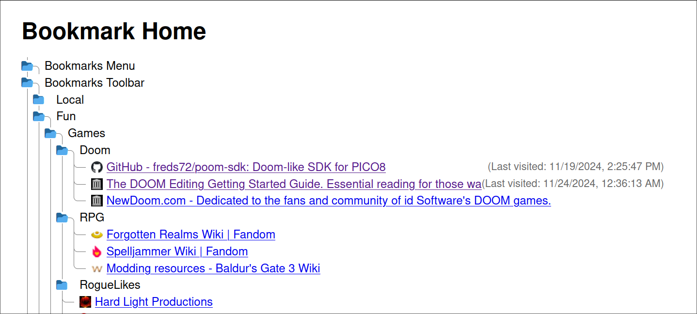

# bookmark-homepage-firefox-plugin

### Rediscover those bookmarks you've been meaning to visit again. Break the habit of defaulting to soso media and YouTube.

It just displays all your bookmarks in a collapsible tree view.

This plugin requires access to your bookmarks and history (but I'll make this optional eventually) for the "last visited" timestamp. This plugin also grabs icons from "www.google.com/s2/favicons".
